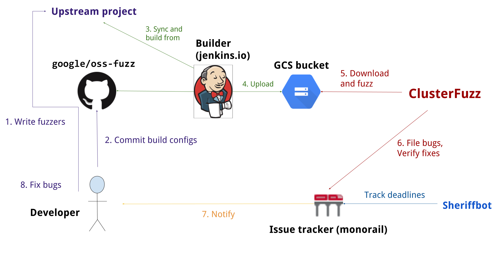

# OSS-Fuzz: Continuous Fuzzing for Open Source Software

[Fuzz testing] is a well-known technique for uncovering programming errors in
software. Many of these detectable errors, like [buffer overflow], can have
serious security implications. Google has found [thousands] of security
vulnerabilities and stability bugs by deploying [guided in-process fuzzing of
Chrome components], and we now want to share that service with the open source
community.

[Fuzz testing]: https://en.wikipedia.org/wiki/Fuzz_testing
[buffer overflow]: https://en.wikipedia.org/wiki/Buffer_overflow
[thousands]: https://bugs.chromium.org/p/chromium/issues/list?q=label%3AStability-LibFuzzer%2CStability-AFL%20-status%3ADuplicate%2CWontFix&can=1
[guided in-process fuzzing of Chrome components]: https://security.googleblog.com/2016/08/guided-in-process-fuzzing-of-chrome.html

In cooperation with the [Core Infrastructure Initiative] and the [OpenSSF],
OSS-Fuzz aims to make common open source software more secure and stable by
combining modern fuzzing techniques with scalable, distributed execution.
Projects that do not qualify for OSS-Fuzz (e.g. closed source) can run their own
instances of [ClusterFuzz] or [ClusterFuzzLite].

[Core Infrastructure Initiative]: https://www.coreinfrastructure.org/
[OpenSSF]: https://www.openssf.org/

We support the [libFuzzer], [AFL++], and [Honggfuzz] fuzzing engines in
combination with [Sanitizers], as well as [ClusterFuzz], a distributed fuzzer
execution environment and reporting tool.

[libFuzzer]: https://llvm.org/docs/LibFuzzer.html
[AFL++]: https://github.com/AFLplusplus/AFLplusplus
[Honggfuzz]: https://github.com/google/honggfuzz
[Sanitizers]: https://github.com/google/sanitizers
[ClusterFuzz]: https://github.com/google/clusterfuzz
[ClusterFuzzLite]: https://google.github.io/clusterfuzzlite/

Currently, OSS-Fuzz supports C/C++, Rust, Go, Python and Java/JVM code. Other languages
supported by [LLVM] may work too. OSS-Fuzz supports fuzzing x86_64 and i386
builds.

[LLVM]: https://llvm.org

## Overview

## Documentation
Read our [detailed documentation] to learn how to use OSS-Fuzz.

[detailed documentation]: https://google.github.io/oss-fuzz

## Trophies
As of January 2022, OSS-Fuzz has found over [36,000] bugs in [550] open source
projects.

[36,000]: https://bugs.chromium.org/p/oss-fuzz/issues/list?q=-status%3AWontFix%2CDuplicate%20-component%3AInfra&can=1
[550]: https://github.com/google/oss-fuzz/tree/master/projects

## Blog posts
* 2016-12-01 - [Announcing OSS-Fuzz: Continuous fuzzing for open source software]
* 2017-05-08 - [OSS-Fuzz: Five months later, and rewarding projects]
* 2018-11-06 - [A New Chapter for OSS-Fuzz]
* 2020-10-09 - [Fuzzing internships for Open Source Software]
* 2020-12-07 - [Improving open source security during the Google summer internship program]

[Announcing OSS-Fuzz: Continuous fuzzing for open source software]: https://opensource.googleblog.com/2016/12/announcing-oss-fuzz-continuous-fuzzing.html
[OSS-Fuzz: Five months later, and rewarding projects]: https://opensource.googleblog.com/2017/05/oss-fuzz-five-months-later-and.html
[A New Chapter for OSS-Fuzz]: https://security.googleblog.com/2018/11/a-new-chapter-for-oss-fuzz.html
[Fuzzing internships for Open Source Software]: https://security.googleblog.com/2020/10/fuzzing-internships-for-open-source.html
[Improving open source security during the Google summer internship program]: https://security.googleblog.com/2020/12/improving-open-source-security-during.html
