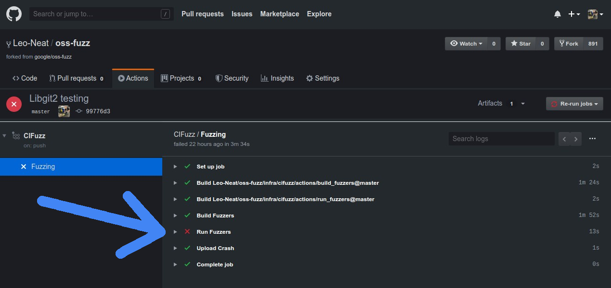
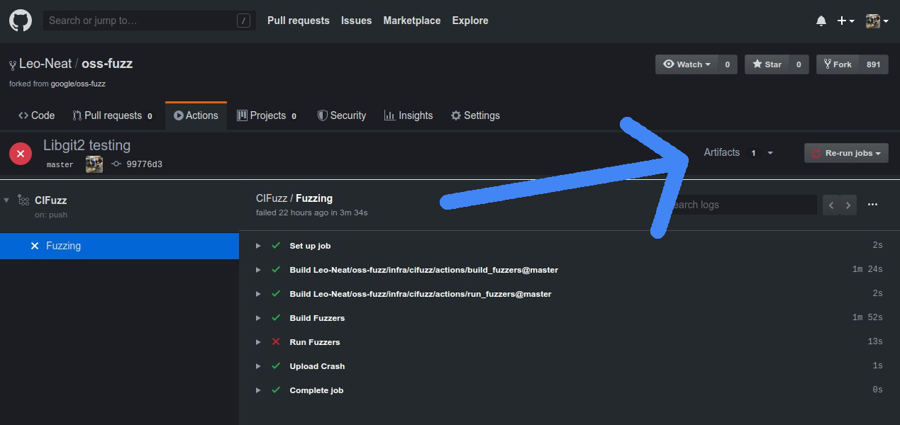

# Continuous Integration

OSS-Fuzz offers **CIFuzz**, a GitHub action/CI job that runs your fuzz targets
on pull requests. This works similarly to running unit tests in CI. CIFuzz helps
you find and fix bugs before they make it into your codebase.
Currently, CIFuzz only supports projects hosted on GitHub.

## How it works

CIFuzz builds your project's fuzzers from the source at a particular
pull request or commit. Then CIFuzz runs the fuzzers for a short amount of time.
If CIFuzz finds a crash, CIFuzz reports the stacktrace, makes the crashing
input available for download and the CI test fails (red X).

If CIFuzz doesn't find a crash during the allotted time, the CI test passes
(green check). If CIFuzz finds a crash, it reports the crash only if both of following are true:
* The crash is reproducible (on the PR/commit build).
* The crash does not occur on older OSS-Fuzz builds. (If the crash does occur
  on older builds, then it was not introduced by the PR/commit
  being tested.)

If your project supports [OSS-Fuzz's code coverage]({{ site.baseurl }}/advanced-topics/code-coverage),
CIFuzz only runs the fuzzers affected by a pull request/commit.
Otherwise it will divide up the allotted fuzzing time (10 minutes by default)
among all fuzzers in the project.

CIFuzz uses 30 day old/public regressions and corpora from OSS-Fuzz. This makes
fuzzing more effective and gives you regression testing for free.

## Requirements

1. Your project must be integrated with OSS-Fuzz.
1. Your project is hosted on GitHub.
1. Your repository needs to be cloned with `git` in oss-fuzz Dockerfile (do not use `go get` or other methods)

## Integrating into your repository

You can integrate CIFuzz into your project using the following steps:
1. Create a `.github` directory in the root of your project.
1. Create a `workflows` directory inside of your `.github` directory.
1. Copy the example [`main.yml`](https://github.com/google/oss-fuzz/blob/master/infra/cifuzz/example_main.yml)
file over from the OSS-Fuzz repository to the `workflows` directory.
1. Change the `oss-fuzz-project-name` value in `main.yml` from `example` to the name of your OSS-Fuzz project. It is **very important** that you use your OSS-Fuzz project name which is case sensitive. This name
is the name of your project's subdirectory in the [`projects`](https://github.com/google/oss-fuzz/tree/master/projects) directory of OSS-Fuzz.
1. Set the value of `fuzz-seconds`. The longest time that the project maintainers are acceptable with should be used. This value should be at minimum 600 seconds and scale with project size.

Your directory structure should look like the following:
```
project
|___ .github
|    |____ workflows
|          |____ main.yml
|___ other-files
```

main.yml for an example project:

```yaml
name: CIFuzz
on: [pull_request]
jobs:
 Fuzzing:
   runs-on: ubuntu-latest
   steps:
   - name: Build Fuzzers
     id: build
     uses: google/oss-fuzz/infra/cifuzz/actions/build_fuzzers@master
     with:
       oss-fuzz-project-name: 'example'
       language: c++
   - name: Run Fuzzers
     uses: google/oss-fuzz/infra/cifuzz/actions/run_fuzzers@master
     with:
       oss-fuzz-project-name: 'example'
       language: c++
       fuzz-seconds: 600
   - name: Upload Crash
     uses: actions/upload-artifact@v1
     if: failure() && steps.build.outcome == 'success'
     with:
       name: artifacts
       path: ./out/artifacts
```


### Optional configuration

#### Configurable Variables

`language`: (optional) The language your target program is written in. Defaults
to `c++`. This should be the same as the value you set in `project.yaml`. See
[this explanation]({{ site.baseurl }}//getting-started/new-project-guide/#language)
for more details.

`fuzz-seconds`: Determines how long CIFuzz spends fuzzing your project in seconds.
The default is 600 seconds. The GitHub Actions max run time is 21600 seconds (6
hours). This variable is only meaningful when supplied to the `run_fuzzers`
action, not the `build_fuzzers` action.

`dry-run`: Determines if CIFuzz surfaces errors. The default value is `false`. When set to `true`,
CIFuzz will never report a failure even if it finds a crash in your project.
This requires the user to manually check the logs for detected bugs. If dry run mode is desired,
make sure to set the dry-run parameters in both the `Build Fuzzers` and `Run Fuzzers` action step.

`allowed-broken-targets-percentage`: Can be set if you want to set a stricter
limit for broken fuzz targets than OSS-Fuzz's check_build. Most users should
not set this. This value is only meaningful when supplied to the `run_fuzzers`
action, not the `build_fuzzers` action.

`sanitizer`: Determines a sanitizer to build and run fuzz targets with. The choices are `'address'`,
`'memory'` and `'undefined'`. The default is `'address'`. It is important to note that the `Build Fuzzers`
and the `Run Fuzzers` sanitizer field needs to be the same. To specify a list of sanitizers
a [matrix](https://help.github.com/en/actions/reference/workflow-syntax-for-github-actions#jobsjob_idstrategymatrix)
can be used. To use a sanitizer add it to the list of sanitizers in the matrix field below:

```yaml

name: CIFuzz
on: [pull_request]
jobs:
 Fuzzing:
   runs-on: ubuntu-latest
   strategy:
     fail-fast: false
     matrix:
       sanitizer: [address, undefined, memory]
   steps:
   - name: Build Fuzzers (${{ matrix.sanitizer }})
     id: build
     uses: google/oss-fuzz/infra/cifuzz/actions/build_fuzzers@master
     with:
       oss-fuzz-project-name: 'example'
       language: c++
       sanitizer: ${{ matrix.sanitizer }}
   - name: Run Fuzzers (${{ matrix.sanitizer }})
     uses: google/oss-fuzz/infra/cifuzz/actions/run_fuzzers@master
     with:
       oss-fuzz-project-name: 'example'
       language: c++
       fuzz-seconds: 600
       sanitizer: ${{ matrix.sanitizer }}
   - name: Upload Crash
     uses: actions/upload-artifact@v1
     if: failure() && steps.build.outcome == 'success'
     with:
       name: ${{ matrix.sanitizer }}-artifacts
       path: ./out/artifacts

```

#### Branches and paths

You can make CIFuzz trigger only on certain branches or paths by following the
instructions [here](https://docs.github.com/en/actions/reference/workflow-syntax-for-github-actions).
For example, the following code can used to trigger CIFuzz only on changes to
C/C++ code residing on master and release branches:

```yaml
name: CIFuzz
on:
  pull_request:
    branches:
      - master
      - 'releases/**'
    paths:
      - '**.c'
      - '**.cc'
      - '**.cpp'
      - '**.cxx'
      - '**.h'
jobs:
 Fuzzing:
   runs-on: ubuntu-latest
   steps:
   - name: Build Fuzzers
     id: build
     uses: google/oss-fuzz/infra/cifuzz/actions/build_fuzzers@master
     with:
       oss-fuzz-project-name: 'example'
       language: c++
   - name: Run Fuzzers
     uses: google/oss-fuzz/infra/cifuzz/actions/run_fuzzers@master
     with:
       oss-fuzz-project-name: 'example'
       language: c++
       fuzz-seconds: 600
   - name: Upload Crash
     uses: actions/upload-artifact@v1
     if: failure() && steps.build.outcome == 'success'
     with:
       name: artifacts
       path: ./out/artifacts
```

You can checkout CIFuzz configs for OSS-Fuzz projects. Example -
[systemd](https://github.com/systemd/systemd/blob/master/.github/workflows/cifuzz.yml),
[curl](https://github.com/curl/curl/blob/master/.github/workflows/fuzz.yml).

## Understanding results

The results of CIFuzz can be found in two different places.

* Run fuzzers log:
    1. This log can be accessed in the `actions` tab of a CIFuzz integrated repo.
    1. Click on the `CIFuzz` button in the workflow selector on the left hand side.
    1. Click on the event triggered by your desired pull request.
    1. Click the `Fuzzing` workflow.
    1. Select the `Run Fuzzer` drop down. It should show the timestamps and results
    from each of the fuzz targets.




*  Artifacts:
    1. When a crash is found by CIFuzz the Upload Artifact event is triggered.
    1. This will cause a pop up in the right hand corner, allowing
    you to download a zip file called `artifacts`.
    1. `artifacts` contains two files for each crash:
        * A test case that can be used to reproduce the crash.
        * The sanitizer stack trace of the crash.




## Feedback/Questions/Issues

Create an issue in [OSS-Fuzz](https://github.com/google/oss-fuzz/issues/new) if you have questions or any other feedback on CIFuzz.
