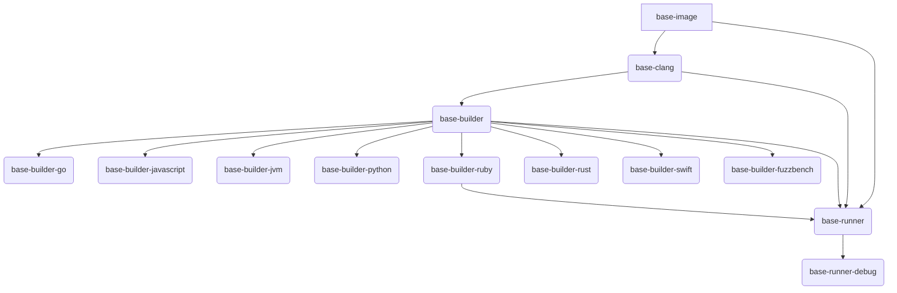

# Base Images

This directory contains the base images used by OSS-Fuzz.

## Building

To build all images, run:

```bash
# run from project root
infra/base-images/all.sh
```

## Dependency Tree

The following diagram shows the dependency tree of the base images.

