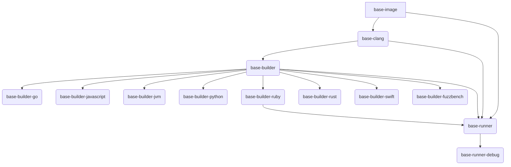

# Base Images

This directory contains the base images used by OSS-Fuzz.

## Building

To build all images, run:

```bash
# run from project root
infra/base-images/all.sh
```

## Trial Builds for Testing Changes

When making changes to any of the base images, it's crucial to test them using the trial build system. This system is designed to build test versions of the images, identified by a `-testing` suffix, and use them to build a subset of OSS-Fuzz projects to ensure the changes don't cause regressions.

### Architecture Overview

The trial build system now supports building multiple Ubuntu base variants in parallel to accelerate testing. The supported variants are:
- `latest` (based on the default `Dockerfile`)
- `ubuntu-20-04` (based on `ubuntu-20-04.Dockerfile`)
- `ubuntu-24-04` (based on `ubuntu-24-04.Dockerfile`)

When a trial build is triggered on a Pull Request that modifies files in `infra/base-images/`, the system initiates three separate, parallel builds in Google Cloud Build (GCB). Each of these builds is responsible for building all base images for a single Ubuntu variant. This parallel architecture allows for faster feedback on changes across different base OS versions.

### How to Trigger a Trial Build

1.  Create a Pull Request with your changes to the base images.
2.  Once the PR is open, add a comment with the following command:
    ```
    /gcbrun trial_build.py all
    ```
3.  This command will be picked up by our CI system. It will first trigger a "coordinator" build, which then spawns the three parallel builds for the different Ubuntu variants. You can monitor the progress of these builds directly in the Google Cloud Build interface linked in your PR.

## Dependency Tree

The following diagram shows the dependency tree of the base images.


